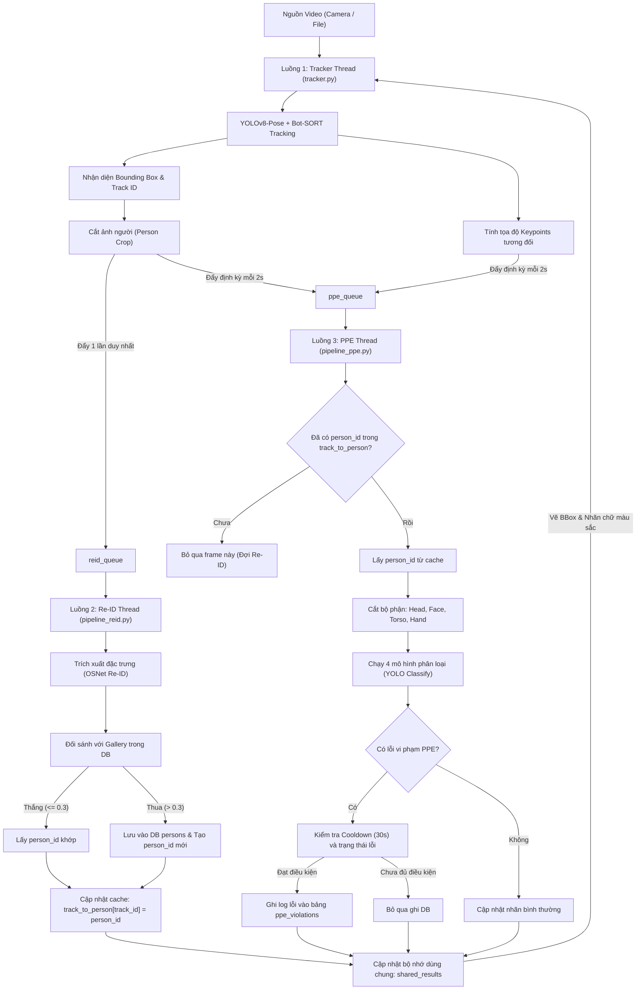

# Real-Time Industrial Safety AI Analytics

Hệ thống giám sát an toàn lao động thời gian thực sử dụng trí tuệ nhân tạo (AI), tích hợp nhận diện danh tính nhân viên (**Person Re-Identification**) và phát hiện vi phạm trang bị bảo hộ lao động (**PPE Detection**).

Hệ thống được thiết kế với kiến trúc **3 luồng song song độc lập (Multi-threading)** tối ưu hiệu năng, giao tiếp qua hàng đợi bất đồng bộ (Queue) và bộ cấu hình tập trung.

---

## 🚀 Các Tính Năng Nổi Bật

1. **Kiến Trúc 3 Luồng Tối Ưu (Multi-threading)**:
   - **Luồng 1 (Tracker Thread)**: Đọc luồng video, chạy bám vết đối tượng (Bot-SORT) và phát hiện tư thế (YOLOv8-Pose).
   - **Luồng 2 (Re-ID Thread)**: Nhận diện danh tính nhân viên bằng mô hình mạng OSNet (chỉ chạy 1 lần khi đối tượng mới xuất hiện).
   - **Luồng 3 (PPE Thread)**: Phân loại đồ bảo hộ lao động qua 4 mô hình YOLO Classification định kỳ mỗi 2 giây.
2. **Cơ Chế Liên Kết Bất Đồng Bộ (Asynchronous Bridging)**:
   - Sử dụng bộ đệm RAM để đồng bộ mã hóa giữa luồng Re-ID và luồng PPE, ngăn ngừa tình trạng trễ hàng đợi hoặc lỗi bất đồng bộ.
3. **Chống Ghi Trùng Database (Smart Cooldown)**:
   - Tích hợp bộ lọc trạng thái và thời gian chờ (mặc định 30 giây) trước khi ghi log lỗi vào SQLite, giảm tải tối đa cho ổ đĩa và database.
4. **Cảnh Báo Màu Sắc Trực Quan (UI Alerts)**:
   - **Màu đỏ**: Phát hiện người lạ (New Employee) hoặc nhân viên đang vi phạm bảo hộ (PPE Violations).
   - **Màu xanh lá**: Nhân viên hợp lệ đã trang bị đầy đủ đồ bảo hộ.
   - **Màu vàng**: Đang trong hàng đợi xử lý định danh.

---

## 📁 Cấu Trúc Thư Mục Dự Án

```text
├── database/
│   ├── connection.py        # Khởi tạo kết nối SQLite và tạo các bảng cấu trúc
│   ├── queries.py           # Định nghĩa các hàm INSERT/SELECT dữ liệu
│   └── factory.db           # Cơ sở dữ liệu SQLite lưu trữ thông tin & logs vi phạm
├── modules/
│   ├── crop_body.py         # Hàm cắt nhỏ ảnh bộ phận (Đầu, Mặt, Thân, Tay) dựa trên keypoints
│   ├── ppe_detection.py     # Lớp PPEDetector chạy 4 model phân loại đồ bảo hộ
│   ├── pipeline_reid.py     # Luồng xử lý định danh nhân viên (OSNet)
│   ├── pipeline_ppe.py      # Luồng xử lý kiểm tra bảo hộ PPE & ghi logs database
│   └── tracker.py           # Luồng chính đọc camera, chạy tracker YOLOv8-pose và vẽ giao diện UI
├── test_media/              # Thư mục chứa các file video để chạy thử nghiệm
├── weights/
│   ├── yolov8n-pose.pt      # Mô hình phát hiện điểm chốt cơ thể (Keypoints Pose)
│   ├── PPE_weights/         # Chứa 4 mô hình phân loại: head_best.pt, face_best.pt, hand_best.pt, torso_best.pt
│   └── re_id_weights/       # Chứa mô hình Re-ID trích xuất vector đặc trưng (model-v1.pth)
├── config.py                # Tệp cấu hình tập trung tất cả tham số của hệ thống
├── main.py                  # Điểm khởi chạy chính của chương trình (Quản lý đa luồng)
├── requirements.txt         # Danh sách thư viện phụ thuộc của dự án
└── README.md                # Tài liệu hướng dẫn sử dụng này
```

---

## ⚙️ Luồng Hoạt Động (Pipeline Architecture)



---

## 🛠️ Hướng Dẫn Cài Đặt & Chạy Dự Án

### 1. Chuẩn bị môi trường
Yêu cầu hệ thống đã cài đặt Python 3.10 trở lên. Khuyên dùng môi trường ảo:

```bash
# Tạo môi trường ảo
python3 -m venv venv

# Kích hoạt môi trường ảo
source venv/bin/activate

# Cài đặt các thư viện phụ thuộc
pip install -r requirements.txt
```

### 2. Cài đặt các file trọng số (Weights)
Tải và đặt các file trọng số vào đúng cấu trúc thư mục sau:
*   Mô hình Pose: `weights/yolov8n-pose.pt`
*   Mô hình Re-ID: `weights/re_id_weights/model-v1.pth`
*   Mô hình PPE: Đặt 4 file `head_best.pt`, `face_best.pt`, `hand_best.pt`, `torso_best.pt` vào thư mục `weights/PPE_weights/`

### 3. Thiết lập tệp cấu hình `config.py`
Mở file `config.py` tại thư mục gốc để tùy chỉnh các tham số theo nhu cầu:
*   `CAMERA_SOURCE`: Thay đổi thành đường dẫn file video chạy thử (ví dụ: `"test_media/test.mp4"`) hoặc để `0` để chạy qua webcam.
*   `USE_GPU`: Chuyển thành `True` nếu thiết bị hỗ trợ GPU CUDA nhằm tối ưu tốc độ xử lý của YOLO và OSNet.
*   `REID_THRESHOLD`: Ngưỡng so khớp đặc trưng cosine (mặc định `0.3`).
*   `PPE_CHECK_INTERVAL`: Tần suất gửi yêu cầu kiểm tra lỗi bảo hộ (mặc định `2.0` giây).
*   `VIOLATION_COOLDOWN_SECONDS`: Thời gian giãn cách ghi lặp lỗi vào DB (mặc định `30` giây).

### 4. Khởi chạy hệ thống
Chạy lệnh sau tại thư mục gốc của dự án:

```bash
python main.py
```
Nhấn phím `q` tại màn hình hiển thị video để dừng chương trình an toàn.

---

## 🗄️ Cấu Trúc Cơ Sở Dữ Liệu (Database Schema)

Dự án sử dụng cơ sở dữ liệu **SQLite** tự động khởi tạo khi chạy (`database/factory.db`):

### 1. Bảng `persons` (Thông tin nhân viên)
| Trường | Kiểu dữ liệu | Mô tả |
| :--- | :--- | :--- |
| `id` | `INTEGER PRIMARY KEY AUTOINCREMENT` | Mã định danh duy nhất của nhân viên |
| `feature_vector` | `BLOB NOT NULL` | Vector đặc trưng Re-ID (512 chiều) |

### 2. Bảng `ppe_violations` (Lịch sử lỗi bảo hộ lao động)
| Trường | Kiểu dữ liệu | Mô tả |
| :--- | :--- | :--- |
| `id` | `INTEGER PRIMARY KEY AUTOINCREMENT` | ID của bản ghi |
| `person_id` | `INTEGER` | Khóa ngoại liên kết bảng `persons` |
| `no_helmet` | `INTEGER` | 1 nếu không đội mũ bảo hộ, ngược lại là 0 |
| `no_glasses` | `INTEGER` | 1 nếu không đeo kính, ngược lại là 0 |
| `no_gloves` | `INTEGER` | 1 nếu không đeo găng tay, ngược lại là 0 |
| `no_vest` | `INTEGER` | 1 nếu không mặc áo bảo hộ, ngược lại là 0 |
| `image_path` | `TEXT` | Đường dẫn lưu ảnh bằng chứng lỗi |

---

## 📊 Benchmark Hệ Thống Cục Bộ (Local Baseline)

Trước khi chuyển đổi sang kiến trúc Microservices / Triton Inference Server, dưới đây là các thông số hiệu năng gốc (baseline) được đo lường trực tiếp trên máy cục bộ bằng source code gốc:

| Thành phần đo lường | Thời gian trung bình | Ghi chú |
| :--- | :--- | :--- |
| **Tốc độ luồng chính (Tracker FPS)** | **~5-6 FPS** | Tốc độ xử lý toàn chuỗi (End-to-End) bị nghẽn do chạy chung tiến trình Python. |
| **Độ trễ YOLO Pose** | **~70 - 130 ms** | Thời gian chạy model phát hiện và vẽ xương (chưa tối ưu TensorRT). |
| **Độ trễ OSNet Re-ID** | **~200 - 250 ms** | Lần tải đầu tiên (Warmup) tốn ~490ms, sau đó ổn định ở mức ~200ms. |
| **Độ trễ PPE Classifiers (4 mô hình)** | **~20 - 50 ms / mô hình** | Rất nhanh sau khi warmup, nhưng nếu có nhiều người sẽ bị cộng dồn. |

> 💡 **Nhận xét chuyên môn:**
> Do đặc thù **GIL (Global Interpreter Lock)** của Python, việc tải 6 mô hình Deep Learning trên 3 luồng (Threads) trong cùng 1 tiến trình đang khiến hệ thống bị **nghẽn nút thắt cổ chai (bottleneck) tại CPU**. Khi chúng ta di dời sang **Triton Inference Server**, các model sẽ được đẩy xuống tầng C++ với cơ chế **Dynamic Batching** và **chạy song song thực sự (True Concurrency)**, hứa hẹn sẽ tăng FPS lên rất nhiều lần.

