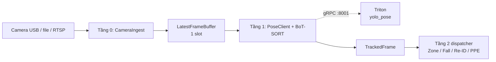

# Workflow Tầng 0–1: Camera Ingest, Pose và Tracking

> **Trạng thái:** milestone test pipeline. Tài liệu này là handoff cho người làm
> Tầng 2 trở đi: Zone, Fall, Re-ID, PPE, Event Bus và Backend.
>
> **Phạm vi:** Tầng 0–1 tạo dữ liệu thời gian thực cho từng camera. Chúng chưa
> ghi database, không upload evidence và không phát Safety Event.

## 1. Bức tranh tổng thể



Mỗi camera chạy trong **một process hệ điều hành riêng**. Trong process đó,
Tầng 0 có một capture thread; Tầng 1 là vòng lặp consumer chạy Pose và tracker.
Triton là service GPU chung, nhận gRPC từ mọi process camera.

```text
Process cam1: capture thread → one-slot buffer → Layer 1 loop ─┐
                                                                 ├→ Triton GPU
Process cam2: capture thread → one-slot buffer → Layer 1 loop ─┘
```

## 2. Tầng 0 — Camera Ingest

### Trách nhiệm

- Mở nguồn camera USB, file video, RTSP hoặc HTTP.
- Với USB: ưu tiên V4L2, MJPG, 1280×720, 25 FPS và driver buffer nhỏ.
- Đọc frame liên tục trong capture thread.
- Luôn chỉ giữ frame mới nhất; không để frame cũ xếp hàng.
- Với camera/stream live bị mất: phát trạng thái offline qua callback, backoff,
  mở lại. Lỗi một camera không làm process camera khác dừng.

### Latest-frame policy

`LatestFrameBuffer` chỉ có một slot. Producer không bao giờ chờ consumer:

```text
Capture tạo frame 10 → buffer chứa 10
Capture tạo frame 11 → thay 10, overwritten += 1
Capture tạo frame 12 → thay 11, overwritten += 1
Tầng 1 rảnh         → nhận frame 12
```

Điều này chủ động bỏ frame cũ để giảm latency. `overwritten` tăng khi Pose/Tầng
1 chậm là hành vi mong đợi, không phải lỗi.

### Input cấu hình

```python
CameraConfig(
    camera_id=1,          # ID camera trong DB tương lai
    camera_key="cam1",    # tên ổn định, dùng prefix track ID
    source=0,             # USB index; cũng nhận /dev/video0, file, RTSP, HTTP
    width=1280,
    height=720,
    fps=25,
    fourcc="MJPG",
)
```

Dùng `/dev/v4l/by-id/...` trong production khi có thể, vì USB index `0`, `2`,
`4` có thể đổi sau khi rút/cắm thiết bị.

### Output: `CapturedFrame`

Định nghĩa ở [`ai_engine/contracts/event_schema.py`](../ai_engine/contracts/event_schema.py).

| Field | Kiểu | Ý nghĩa |
|---|---|---|
| `camera_id` | `int` | ID camera, sẽ map tới database sau này |
| `camera_key` | `str` | Ví dụ `cam1` |
| `sequence_id` | `int` | Tăng dần riêng từng camera |
| `captured_at` | `float` | Unix epoch ngay lúc đọc frame |
| `frame_bgr` | `np.ndarray` | Frame OpenCV `uint8`, shape H×W×3, chỉ ở RAM |
| `frame_width`, `frame_height` | `int` | Kích thước frame gốc |

`CapturedFrame` không được serialize JSON, gửi HTTP, ghi DB, hoặc copy qua nhiều
process. Nó thuộc vòng đời ngắn trong process camera.

## 3. Tầng 1 — Pose Triton và BoT-SORT

### Trách nhiệm

1. Lấy `CapturedFrame` mới nhất từ buffer.
2. Bỏ frame quá cũ nếu tuổi vượt `max_frame_age_ms` (mặc định 250 ms).
3. Gọi `yolo_pose` qua Triton gRPC.
4. Decode output, confidence filter và NMS trong `PoseClient`.
5. Đưa detection vào BoT-SORT local để có track ID ổn định.
6. Ghép chính xác track với keypoint theo `det_index` của BoxMOT; fallback bằng
   IoU chỉ khi phiên bản BoxMOT không trả index.
7. Xuất `TrackedFrame` cho Tầng 2.

### Triton contract

Model repo: [`triton_model_repo/yolo_pose/`](../triton_model_repo/yolo_pose/)

| Thành phần | Giá trị |
|---|---|
| Service | Triton gRPC `localhost:8001` |
| Model | `yolo_pose` |
| Input | `images_u8`, `UINT8`, CHW 3×640×640 |
| Output | `output0`, `FP32`, shape batch×56×dynamic-anchor |
| Batching | tối đa 2, ưu tiên batch 2, delay tối đa 2 ms |

Mọi camera gửi request độc lập; Triton tự gom những request Pose đồng thời thành
batch. Không tạo CPU queue trung tâm để batch frame.

### Output: `TrackedFrame`

`TrackedFrame` giữ nguyên frame và metadata capture của Tầng 0, bổ sung danh sách
`persons`. Một `TrackObservation` là một người trong frame.

| Field của `TrackObservation` | Ý nghĩa |
|---|---|
| `track_id` | Ví dụ `cam1-17`; cục bộ theo camera nhưng có prefix camera |
| `bbox_xyxy` | `float32 [x1, y1, x2, y2]`, tọa độ frame gốc |
| `keypoints` | `float32 (17, 3)`: `x`, `y`, confidence, tọa độ frame gốc |
| `detection_confidence` | confidence Pose |
| `timestamp` | bằng `CapturedFrame.captured_at`, không thay bằng thời điểm inference |

`track_id` **không phải** `person_id`. Re-ID ở Tầng 2 mới quyết định danh tính
toàn cục và có thể chưa biết `person_id` khi track mới xuất hiện.

## 4. Handoff cho Tầng 2

Tầng 2 nhận một `TrackedFrame` qua callback/dispatcher trong cùng process camera.
Không đẩy cả `TrackedFrame` vào mọi queue. Dispatcher phải tạo task tối thiểu:

| Nhánh | Input nên nhận | Tần suất |
|---|---|---|
| Zone | `camera_id`, `track_id`, `bbox_xyxy`, timestamp | Mọi frame |
| Fall | `camera_id`, `track_id`, keypoints, timestamp | Mọi frame |
| Re-ID | `camera_id`, `track_id`, `person_crop.copy()`, timestamp | Track mới/re-check |
| PPE | `camera_id`, `track_id`, `person_crop.copy()`, keypoint relative crop, timestamp | Theo chu kỳ PPE |

Quy tắc bắt buộc:

- Không sửa `frame_bgr`, bbox hoặc keypoint sau khi message đã được tạo.
- Crop đưa qua queue phải `.copy()` để task sở hữu dữ liệu của nó.
- Zone và Fall không cần nhận ảnh, tránh copy frame lớn.
- Giữ `captured_at` xuyên suốt đến Fall/Event để latency và chuỗi thời gian đúng.
- Không gọi database, R2 hay HTTP blocking trong Tầng 0/1 frame loop.

## 5. Metrics và visual demo

Demo Tầng 1 vẽ:

- bounding box xanh, `track_id`, skeleton pose;
- processing FPS;
- Pose latency (ms);
- BoT-SORT latency (ms);
- end-to-end latency: `now - captured_at`;
- số track active và stale-frame drop.

Đây là metrics local/log. Telemetry gửi backend là việc của tầng sau.

## 6. File quan trọng

| File | Vai trò |
|---|---|
| `ai_engine/contracts/event_schema.py` | Contract `CapturedFrame`, `TrackedFrame`, `TrackObservation` |
| `ai_engine/ingest/latest_frame.py` | One-slot latest-frame buffer |
| `ai_engine/ingest/camera_stream.py` | `CameraConfig`, OpenCV stream, capture thread/reconnect |
| `ai_engine/tracking/botsort_adapter.py` | Cô lập API BoxMOT và mapping detection/keypoint |
| `ai_engine/pipeline/layer1_processor.py` | Pose + tracker thành `TrackedFrame`, metrics |
| `ai_engine/testing/layer1_demo.py` | Runner visual test độc lập nhiều camera |
| `run_layer0_multi.sh` | Test Tầng 0 nhiều camera, không cần Triton |
| `run_layer1_demo.sh` | Tự khởi động Triton, chờ `yolo_pose`, chạy visual Tầng 1 |
| `triton_model_repo/yolo_pose/config.pbtxt` | Triton input/output và dynamic batching Pose |
| `tests/test_layer0.py` | Test latest-frame và parser camera |
| `tests/test_layer1_processor.py` | Test `TrackedFrame` và mapping `det_index` → keypoint |

## 7. Cách chạy và kiểm tra

Tầng 0, hai USB camera:

```bash
./run_layer0_multi.sh --camera 1:cam1:0 --camera 2:cam2:2 --show
```

Tầng 1, hai USB camera (script tự khởi động Triton):

```bash
./run_layer1_demo.sh --camera 1:cam1:0 --camera 2:cam2:2 --show
```

Trước khi merge/push, chạy:

```bash
.venv/bin/python tests/test_layer0.py
.venv/bin/python tests/test_layer1_processor.py
git diff --check
```

## 8. Phạm vi chưa có

- Launcher production đọc camera từ DB và hot-add/hot-remove camera.
- Supervisor tự restart child process nếu process crash.
- Dispatcher/queue Tầng 2 và các nhánh Zone/Fall/Re-ID/PPE.
- Event Bus, backend telemetry, database và evidence upload.
- Kiểm chứng performance thật với hai USB camera trong điều kiện nhà máy.
