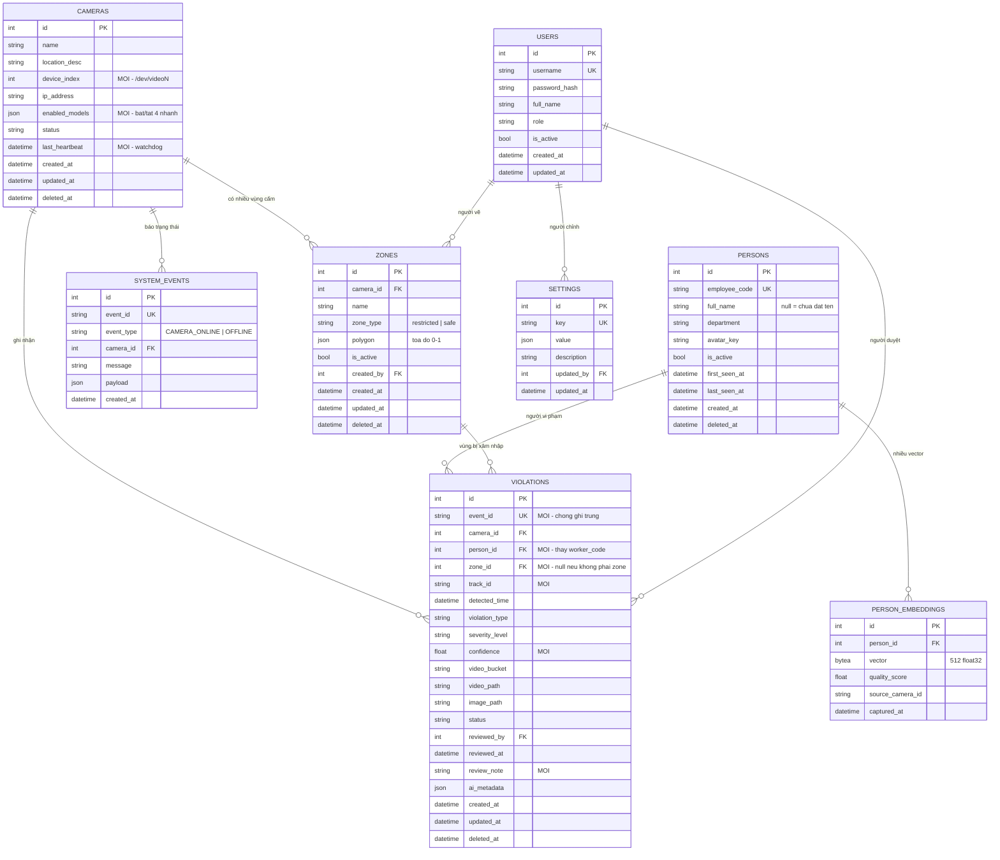

# Schema Dữ Liệu & Sự Kiện

> **v1 — đề xuất, chờ chốt tại kickoff (26/07/2026).** Bản trình bày đầy đủ: [artifact](https://claude.ai/code/artifact/5502539f-5808-435d-960f-ea026fbabf6f) · Kiến trúc tổng: [ARCHITECTURE.md](ARCHITECTURE.md) · Phân công: [TEAM_PLAN.md](TEAM_PLAN.md)

Mở rộng từ 3 bảng hiện có lên **8 bảng**, đủ để chạy cả 4 tính năng: Re-ID · PPE · Vùng cấm · Phát hiện ngã.

| Trạng thái | Số bảng | Tên |
|---|---|---|
| 🟢 Giữ nguyên | 1 | `users` |
| 🔵 Sửa | 2 | `violations`, `cameras` |
| 🟠 Thêm mới | 5 | `zones`, `persons`, `person_embeddings`, `system_events`, `settings` |

## Ba bảng hiện tại thiếu gì

| Tính năng | Cần lưu gì | Hiện tại |
|---|---|---|
| Vùng cấm | Polygon từng camera, ai vẽ, sửa lúc nào | Không có bảng nào chứa |
| Re-ID | Vector đặc trưng 512 chiều của từng nhân viên | Chỉ có `worker_code` dạng chuỗi |
| Chống ghi trùng | Mã sự kiện duy nhất | Không có → worker gửi lại là ghi 2 dòng |
| Chỉnh ngưỡng runtime | Giá trị cấu hình sửa được từ UI | Không có bảng nào chứa |

---

## ERD đề xuất



> **Vì sao tách `system_events` khỏi `violations`:** camera mất kết nối không phải "vi phạm an toàn". Trộn chung sẽ khiến trang Violations lẫn lộn giữa việc người vận hành cần xử lý (có người ngã) và việc quản trị viên cần theo dõi (camera 2 offline). Hai đối tượng, hai luồng công việc, hai bảng.

---

## Năm bảng thêm mới

### `zones` — vùng cấm

Polygon vẽ từ dashboard. Lưu **tọa độ chuẩn hóa 0–1**, không phải pixel — đổi độ phân giải camera hay kích thước khung vẽ đều không lệch vùng.

| Cột | Kiểu | Ghi chú |
|---|---|---|
| `id` | int PK | |
| `camera_id` | int FK → cameras | |
| `name` | varchar(120) | |
| `zone_type` | varchar(20) | `restricted` \| `safe` |
| `polygon` | json | `[[0.12,0.30], [0.55,0.30], ...]` — **0 ≤ x,y ≤ 1** |
| `is_active` | bool | |
| `created_by` | int FK → users | audit: ai vẽ |
| `created_at` / `updated_at` / `deleted_at` | timestamptz | soft delete |

### `persons` — danh tính nhân viên

`full_name` để trống nghĩa là hệ mới thấy người này nhưng chưa ai đặt tên — dashboard hiển thị "Người #47" cho tới khi được gán tên qua trang Persons.

| Cột | Kiểu | Ghi chú |
|---|---|---|
| `id` | int PK | |
| `employee_code` | varchar(40) unique | null nếu chưa enrollment |
| `full_name` | varchar(120) null | null = chưa đặt tên |
| `department` | varchar(80) | |
| `avatar_key` | varchar(255) | object key trên R2 |
| `is_active` | bool | nhân viên còn làm việc |
| `first_seen_at` / `last_seen_at` | timestamptz | |

### `person_embeddings` — gallery Re-ID

**Nhiều vector cho mỗi người** — đây là điểm quan trọng nhất. Một vector duy nhất sẽ hỏng dần khi người đó đứng góc khác, ánh sáng khác. Nhiều vector cho phép so khớp top-k và cập nhật dần theo thời gian.

| Cột | Kiểu | Ghi chú |
|---|---|---|
| `id` | int PK | |
| `person_id` | int FK → persons | ON DELETE CASCADE |
| `vector` | bytea | `np.float32[512].tobytes()` = 2048 byte |
| `quality_score` | float | độ tin cậy lúc trích xuất |
| `source_camera_id` | varchar(16) | trích từ camera nào |
| `captured_at` | timestamptz | |

> Khi gallery vượt vài nghìn vector thì cân nhắc chuyển cột `vector` sang **pgvector** để tìm kiếm bằng chỉ mục. Hiện tại so cosine trong Python là đủ.

### `system_events` — nhật ký sức khỏe hệ thống

Camera lên/xuống, worker khởi động, model lỗi. Tách riêng để không lẫn vào danh sách vi phạm.

| Cột | Kiểu | Ghi chú |
|---|---|---|
| `id` | int PK | |
| `event_id` | varchar(36) unique | idempotency |
| `event_type` | varchar(32) | `CAMERA_ONLINE` \| `CAMERA_OFFLINE` \| `WORKER_START` \| `MODEL_ERROR` |
| `camera_id` | int FK null | null nếu sự kiện toàn hệ |
| `message` | text | |
| `payload` | json | |

### `settings` — cấu hình chỉnh runtime

Ngưỡng sửa được từ trang Settings mà không phải khởi động lại. Dạng khóa–giá trị nên thêm tham số mới không cần migration.

| Cột | Kiểu |
|---|---|
| `id` | int PK |
| `key` | varchar(60) unique |
| `value` | json |
| `description` | text |
| `updated_by` | int FK → users |
| `updated_at` | timestamptz |

Khóa mặc định cần seed:

```
reid_threshold          0.3
ppe_check_interval_s    2.0
violation_cooldown_s    30
fall_threshold          0.05
fall_debounce_m         2
fall_debounce_n         3
zone_debounce_frames    5
retention_days          30
stream_fps              8      # FPS cho MJPEG, tách khỏi FPS của AI
```

---

## Hai bảng cần sửa

### `violations` — thêm 6 cột, bỏ 1

| Cột | Kiểu | Vì sao |
|---|---|---|
| ➕ `event_id` | varchar(36) unique | **Chống ghi trùng** khi worker gửi lại |
| ➕ `person_id` | int FK null | Thay `worker_code` — có khóa ngoại mới truy được lịch sử theo người |
| ➕ `zone_id` | int FK null | Vi phạm vùng cấm thì trỏ tới vùng nào |
| ➕ `track_id` | varchar(32) | `cam1-17` — truy vết ngược về worker |
| ➕ `confidence` | float | Điểm tin cậy của model |
| ➕ `review_note` | text | Ghi chú của người duyệt |
| ➖ `worker_code` | — | Thay bằng `person_id` FK |

### `cameras` — thêm 4 cột

| Cột | Kiểu | Vì sao |
|---|---|---|
| ➕ `device_index` | int | Camera USB dùng `/dev/video0`, không phải IP |
| ➕ `enabled_models` | json | `{"reid":true,"ppe":true,"zone":true,"fall":false}` — khớp ô tích trên UI |
| ➕ `last_heartbeat` | timestamptz | Watchdog phát hiện worker chết |
| ➕ `resolution` / `fps` | varchar / int | `1280x720` @ 25 |

### Chỉ mục cần thêm

```sql
-- Truy vấn chính của trang Violations: lọc theo camera + khoảng thời gian
CREATE INDEX ix_violations_camera_time ON violations (camera_id, created_at DESC);
CREATE INDEX ix_violations_person      ON violations (person_id, created_at DESC);
CREATE INDEX ix_violations_type_sev    ON violations (violation_type, severity_level);
-- Chống ghi trùng khi worker gửi lại
CREATE UNIQUE INDEX ux_violations_event ON violations (event_id);
```

---

## Định dạng sự kiện (Hợp đồng ①)

Nguồn code: [`ai_engine/events.py`](../ai_engine/events.py)

Một sự kiện là JSON worker gửi sang backend. Nó **không chứa bytes ảnh** — chỉ chứa đường dẫn tới file ảnh worker vừa ghi ra đĩa; backend đọc rồi đẩy lên R2.

```jsonc
{
  "event_id":         "b3f1c8e2-...",     // UUID, chống ghi trùng
  "camera_id":        1,
  "violation_type":   "RESTRICTED_ZONE",
  "severity_level":   "DANGER",
  "track_id":         "cam1-17",           // số của tracker, KHÔNG phải danh tính
  "person_id":        42,                  // null nếu Re-ID chưa nhận ra
  "detected_time":    "2026-07-26T08:15:32.120Z",
  "confidence":       0.87,
  "image_spool_path": "/spool/cam1-abc.jpg",
  "video_spool_path": null,
  "ai_metadata_json": "{\"zone_id\": 3, \"zone_name\": \"Trạm điện\"}"
}
```

### Bảy loại sự kiện và nơi chúng đi tới

| `violation_type` | Mức độ | Ghi vào bảng | `ai_metadata` |
|---|---|---|---|
| `PPE_VIOLATION` | DANGER | `violations` | `{no_helmet, no_glasses, no_gloves, no_vest}` |
| `RESTRICTED_ZONE` | DANGER | `violations` + `zone_id` | `{zone_id, zone_name}` |
| `FALL_DETECTED` | CRITICAL | `violations` | `{score, detector:"model"}` |
| `FALL_SUSPECTED` | WARNING | `violations` | `{score, detector:"heuristic"}` |
| `EMERGENCY` | CRITICAL | `violations` | `{triggered_by, message}` |
| `CAMERA_OFFLINE` | WARNING | **`system_events`** | `{}` |
| `CAMERA_ONLINE` | INFO | **`system_events`** | `{}` |

> **Một sự kiện PPE gộp cả 4 lỗi, không tách thành 4 sự kiện.** Một lần kiểm tra = một dòng trong database = một thông báo trên màn hình. Tách ra sẽ làm ngập cả bảng dữ liệu lẫn danh sách cảnh báo gấp bốn lần.

### Đường đi của một sự kiện

```
4 nhánh phân tích  →  publish()  →  buffer 200 chỗ  →  thread nền
                                                            ↓  HTTP POST
                          ┌─────────────────────────────────┘
                          ↓
   backend nhận  →  kiểm tra event_id đã có chưa
                 →  INSERT violations
                 →  đọc ảnh từ spool → upload R2 → điền image_path → xóa spool
                 →  bổ sung tên camera + tên người
                 →  broadcast WebSocket → dashboard hiện cảnh báo
```

---

## Thứ tự triển khai

| # | Việc | Ai |
|---|---|---|
| 1 | **Chốt schema tại kickoff** — cả 4 người review, sửa, thống nhất. Sau đó mọi thay đổi phải báo cả team | cả team |
| 2 | Viết migration Alembic: 5 bảng mới + 6 cột thêm vào `violations` + 4 chỉ mục | Data #1 |
| 3 | Seed dữ liệu: 2 camera USB, 1 admin, giá trị mặc định trong `settings` | Data #1 |
| 4 | Bổ sung SQLAlchemy models trong `backend/models/db/` | Data #1 |
| 5 | Endpoint `POST /api/v1/internal/events` — hiện worker gửi sang sẽ nhận 404 | Data #2 |
| 6 | API vùng cấm (thêm/sửa/xóa polygon) + trình vẽ trên khung hình | Data #2 |
| 7 | Trang Persons — đặt tên cho người mà Re-ID mới phát hiện | Data #2 |
| 8 | Worker phát sự kiện — cắm `publish()` vào 4 nhánh phân tích | AIE #1 |
| 9 | Dịch vụ định danh chống trùng — "tìm hoặc tạo người mới" chỉ xảy ra ở một chỗ duy nhất | AIE #2 |

## ⚠️ Hai điểm dễ bỏ sót

1. **Vector Re-ID là dữ liệu sinh trắc học** — Nghị định 13/2023 yêu cầu cơ sở pháp lý và thông báo cho người lao động trước khi thu thập. Cần hỏi phía nhà máy sớm.
2. **Tọa độ polygon phải chuẩn hóa 0–1 ngay từ khi frontend gửi lên** — lưu pixel là mọi vùng cấm sẽ lệch khi đổi độ phân giải.
