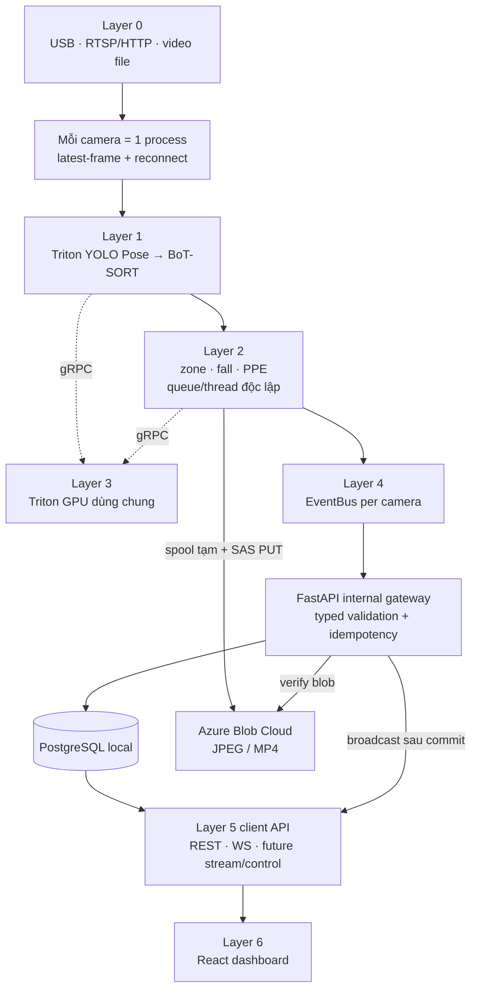
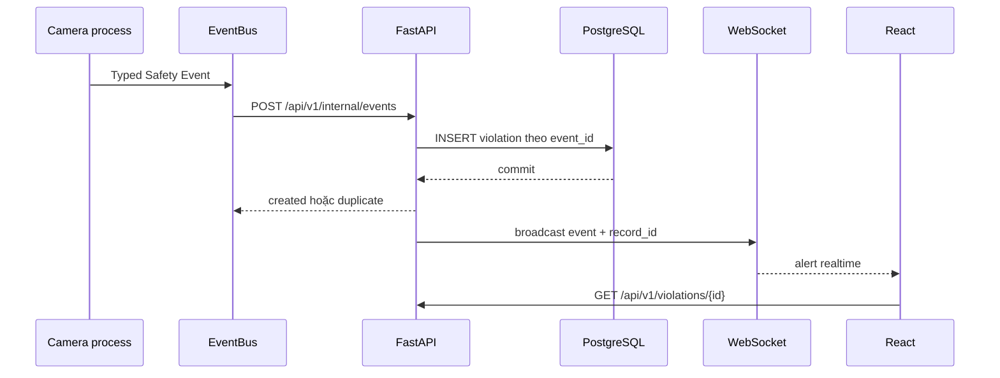
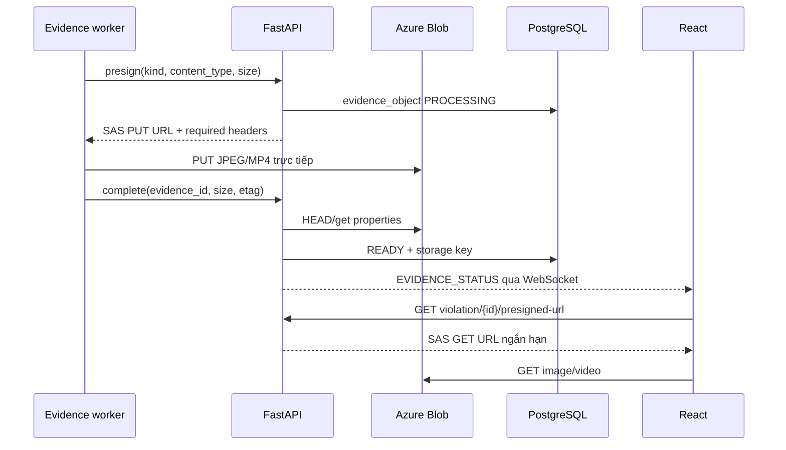

# Bàn giao hệ thống cho đội Backend, API và UI/UX — Layer 5–6

Cập nhật: 2026-08-01
Đối tượng đọc: backend developer, frontend developer, UI/UX designer, QA và DevOps
Nguồn sự thật về event/pipeline Layer 0–4: [PRODUCT_PIPELINE.md](PRODUCT_PIPELINE.md)

## 1. Mục đích và phạm vi

Tài liệu này trả lời bốn câu hỏi để đội tiếp theo có thể bắt đầu mà không phải đọc toàn bộ lịch sử nhánh:

1. Hệ thống hiện đã chạy thật đến đâu?
2. Dữ liệu đi qua các layer và API nào?
3. File nào là nơi cần đọc hoặc sửa cho từng phần việc?
4. Layer 5 Backend API và Layer 6 React Dashboard còn phải làm gì?

### Lộ trình đọc theo vai trò

- Backend/API: đọc mục 3–10, 13–17 và 19.
- Frontend: đọc mục 4, 8–14, 16–19.
- UI/UX: đọc mục 2, 4, 11–14 và Definition of Done ở mục 17.
- QA/DevOps: đọc mục 2–4, 7–10 và 15–19.
- AI/Camera: tập trung ranh giới Layer 4 → 5, runtime control và streaming.

Cách đánh số layer giữ theo `docs/ARCHITECTURE.md` trên nhánh `feature/ai-pipeline-integration`:

- Layer 0: camera/video ingest.
- Layer 1: pose và tracking.
- Layer 2: zone, fall, PPE.
- Layer 3: Triton Inference Server.
- Layer 4: event, PostgreSQL và evidence storage.
- Layer 5: client-facing backend/API/stream/control.
- Layer 6: web dashboard.

Có một điểm dễ nhầm: trong code hiện tại, logical Layer 4 event gateway và phần đầu của Layer 5 REST API cùng chạy trong một FastAPI service. Đó là lựa chọn triển khai hiện tại, không có nghĩa hai layer có cùng trách nhiệm.

Tài liệu kiến trúc cũ chỉ được dùng để giữ numbering và mục tiêu sản phẩm. Những chi tiết đã lỗi thời như Cloudflare R2, Re-ID đang chạy, MJPEG đã hoàn thiện hoặc frontend đã nối API không còn đúng.

## 2. Trạng thái hiện tại — đọc nhanh

| Thành phần | Trạng thái | Ghi chú |
|---|---|---|
| Layer 0 ingest | Chạy được | USB, RTSP/HTTP và video file; một process cho mỗi camera; latest-frame buffer |
| Layer 1 pose/tracking | Chạy được | YOLO Pose qua Triton; BoT-SORT local; track ID chỉ có ý nghĩa trong camera |
| Layer 2 zone | Logic chạy được, thiếu config sync | Có point-in-polygon/debounce; polygon đã lưu DB nhưng runner chưa tự tải |
| Layer 2 fall | Chạy được ở mức beta | Temporal keypoint model trên Triton; threshold/debounce; cần field test |
| Layer 2 PPE | Chạy được | Phát typed event khi trạng thái lỗi thay đổi |
| Re-ID | Không thuộc phase hiện tại | Không có trong runtime/model toggle; không được giả định có person identity |
| Layer 3 Triton | Chạy được | `yolo_pose` và `fall_model` thuộc đường test chính; repository còn các model PPE/Re-ID |
| EventBus | Chạy được | Queue hữu hạn, retry lỗi tạm thời, không block hot loop |
| PostgreSQL | Chạy local | PostgreSQL 16 trong Docker volume; Alembic migration trước backend |
| Azure evidence | Chạy cloud thật | PPE/zone: JPEG; fall: JPEG + MP4; direct SAS upload |
| Layer 5 REST | Một phần chạy thật | Auth, cameras, zones, violations, reports, evidence download |
| Layer 5 WebSocket | Chạy bản đơn instance | Broadcast event sau DB commit; chưa auth/replay/multi-instance |
| Layer 5 streaming | Chưa nối | `streaming.py` mới có generator skeleton, chưa có route/frame transport |
| Runtime control | Chưa nối | DB lưu toggle/zone nhưng chưa đẩy nóng xuống camera process |
| Layer 6 React | Prototype UI | Nhiều page/style đã có nhưng dùng mock data; chưa có API client/auth/WS |
| Automated tests | 44 pass | Hai warning dependency/Pydantic cũ |
| Frontend build | Chưa xác minh trong worktree này | `frontend/node_modules` chưa được cài |

Azure cloud đã được smoke test thật theo luồng:

```text
FastAPI → PostgreSQL local → SAS PUT Azure Blob
        → backend HEAD/properties verify → READY
        → SAS GET → nội dung tải về khớp
```

Kết quả smoke test: upload HTTP 201, download HTTP 200, `evidence_status=READY`.

## 3. Kiến trúc đang chạy



### Ranh giới trách nhiệm

| Ranh giới | Producer | Consumer | Contract |
|---|---|---|---|
| Layer 0 → 1 | Camera ingest | Pose/tracker | `CapturedFrame` nội bộ |
| Layer 1 → 2 | Pose/tracker | Analytics | `TrackedFrame` nội bộ |
| Layer 2 → 4 | Analytics | EventBus/FastAPI | Typed Safety Event |
| Supervisor → 4 | Camera supervisor | FastAPI | `CameraStatusEvent` |
| AI evidence → 4 | Evidence uploader | FastAPI/Azure | presign → PUT → complete/fail |
| Layer 4 → 5 | PostgreSQL/event gateway | Client API | ORM/service → Pydantic response |
| Layer 5 → 6 | FastAPI | React | REST JSON + WebSocket JSON + SAS GET |
| Layer 5 → camera | Chưa có | Camera runtime | Runtime control contract cần xây |

## 4. Hai luồng cần hiểu trước khi làm UI

### 4.1 Luồng cảnh báo



`event_id` là khóa idempotency. EventBus có thể retry nhưng PostgreSQL không tạo hai violation cho cùng event.

### 4.2 Luồng evidence



FastAPI không proxy bytes JPEG/MP4. Connection string chỉ ở backend. Camera/frontend chỉ nhận SAS URL có thời hạn.

File trong `evidence_spool/` là tạm thời để retry. Sau khi backend xác nhận `READY`, uploader mới xóa file và manifest local.

## 5. Cấu trúc repository hiện tại

```text
final_product/
├── ai_engine/                         # Layer 0–2 và event producer
│   ├── contracts/event_schema.py      # Contract nguồn phía AI
│   ├── ingest/                        # Camera source + latest frame
│   ├── inference/                     # Triton clients
│   ├── tracking/                      # BoT-SORT adapter
│   ├── analytics/                     # zone, fall, PPE, Re-ID legacy/deferred
│   ├── pipeline/                      # Layer 1, Layer 2, multi-camera runner
│   ├── visualization/                 # Bbox/ID/alert overlay
│   ├── events.py                      # EventBus HTTP + retry
│   └── evidence.py                    # Capture/spool/direct Azure upload
│
├── backend/                           # Logical Layer 4 gateway + Layer 5 API
│   ├── main.py                        # FastAPI, CORS, health, WebSocket
│   ├── api/v1/
│   │   ├── api.py                     # Router registry
│   │   └── endpoints/
│   │       ├── internal.py            # Machine-to-machine event/evidence API
│   │       ├── auth.py                # Register/login/me
│   │       ├── cameras.py             # Camera CRUD
│   │       ├── zones.py               # Zone CRUD
│   │       ├── violations.py          # Query/review/evidence URL
│   │       └── reports.py             # Summary hiện tại
│   ├── models/
│   │   ├── db/                        # SQLAlchemy ORM
│   │   └── schemas/                   # Pydantic request/response
│   ├── services/                      # Business logic
│   ├── migrations/                    # Alembic revisions
│   ├── core/                          # Settings, JWT dependency, security
│   ├── storage.py                     # Azure Blob adapter/SAS
│   ├── ws.py                          # In-memory WebSocket fan-out
│   └── streaming.py                   # MJPEG skeleton, chưa nối
│
├── frontend/                          # Layer 6 React prototype
│   ├── src/App.tsx                    # Route registry
│   ├── src/pages/                     # Dashboard/Cameras/Violations/...
│   ├── src/layouts/                   # AuthLayout/MainLayout
│   ├── src/services/index.ts          # Hiện chưa có API client
│   ├── src/types/index.ts             # Hiện chưa có shared API types
│   └── src/store/index.ts             # Hiện chưa có application state
│
├── triton_model_repo/                 # Layer 3 model repository
├── tests/                             # Contract, layer, event, evidence tests
├── docs/
│   ├── PRODUCT_PIPELINE.md            # Contract chuẩn Layer 0–4
│   └── TEAM_ONBOARDING_LAYER5_6.md    # Tài liệu này
├── docker-compose.yml                 # Postgres/Adminer/backend/Triton
├── alembic.ini                        # Migration config
├── .env.example                       # Mẫu biến môi trường, không có secret
└── run_pipeline_demo.sh               # Product-path smoke test
```

Các file `database/factory.db`, `database/connection.py`, `main.py` ở root và gRPC backend cũ không phải contract tích hợp mới. Không mở rộng chúng trước khi xác nhận còn consumer.

## 6. Bản đồ file theo trách nhiệm

### Contract và concurrency — thay đổi phải thận trọng

| File | Vai trò | Đội thường sửa |
|---|---|---|
| `ai_engine/contracts/event_schema.py` | Dataclass/enum nguồn cho frame, task và event | AI + backend cùng review |
| `backend/models/schemas/event.py` | Validation typed event phía nhận | Backend |
| `ai_engine/pipeline/runner.py` | Multi-process camera orchestration | AI/Platform |
| `ai_engine/pipeline/layer2_runtime.py` | Queue, thread, model toggle | AI |
| `ai_engine/events.py` | Retry/backpressure/service-token HTTP | AI + backend |
| `ai_engine/evidence.py` | Ring buffer, JPEG/MP4, retry manifest | AI + backend |
| `backend/services/evidence_service.py` | State machine PROCESSING/READY/FAILED | Backend |
| `backend/storage.py` | SAS signing và Azure client | Backend/Infra |

### Layer 5

| File | Vai trò |
|---|---|
| `backend/main.py` | App lifecycle, middleware, health, `/ws/alerts` |
| `backend/api/v1/api.py` | Danh sách router public/internal |
| `backend/api/v1/endpoints/*.py` | HTTP boundary; không đặt business logic lớn tại đây |
| `backend/services/*.py` | Business rules, transaction/commit |
| `backend/models/schemas/*.py` | Public request/response contract |
| `backend/models/db/*.py` | ORM mapping |
| `backend/migrations/versions/*.py` | Lịch sử schema DB; không sửa revision đã phát hành |
| `backend/core/deps.py` | DB session và JWT user dependency |
| `backend/core/security.py` | Auth implementation; cần harden trước production |
| `backend/ws.py` | WebSocket hub một process |
| `backend/streaming.py` | Placeholder cho live preview |

### Layer 6

| File | Vai trò |
|---|---|
| `frontend/src/App.tsx` | Route thật đang được mount |
| `frontend/src/pages/*` | UI page hiện tại |
| `frontend/src/services/index.ts` | Nơi cần bắt đầu API client |
| `frontend/src/types/index.ts` | Shared domain/API types |
| `frontend/src/store/index.ts` | Auth/session/realtime state |
| `frontend/src/layouts/*` | Navigation và auth/main shell |
| `frontend/src/hooks/useTheme.ts` | Phần duy nhất đang persist localStorage |
| `frontend/vite.config.ts` | Alias/build/dev server |

## 7. Database hiện tại

PostgreSQL là nguồn dữ liệu cấu trúc. Azure Blob là nguồn bytes evidence. PostgreSQL chỉ lưu object key và metadata, không lưu ảnh/video dạng binary.

| Bảng | Vai trò | Quan hệ chính |
|---|---|---|
| `users` | Tài khoản và role | reviewer của violation |
| `cameras` | Camera, source, status, model toggles | zones, violations, system_events |
| `zones` | Polygon normalized và trạng thái active | thuộc camera |
| `violations` | Một safety event đã persist | camera, optional zone/reviewer |
| `evidence_objects` | Từng IMAGE/VIDEO và lifecycle | thuộc violation |
| `system_events` | Camera ONLINE/OFFLINE history | thuộc camera |

Không có bảng `persons` trong schema hiện tại vì Re-ID đã hoãn.

### Giá trị trạng thái cần giữ thống nhất

- `violations.status`: `NEW`, `REVIEWED`, `DISMISSED`, `RESOLVED`.
- `violations.evidence_status`: `PROCESSING`, `READY`, `FAILED`.
- `evidence_objects.kind`: `IMAGE` hoặc `VIDEO`.
- `cameras.status`: runtime đang dùng `ONLINE`, `OFFLINE`; soft delete đặt `DELETED`.
- Model toggles: `zone_enabled`, `fall_enabled`, `ppe_enabled`.

Hiện nhiều giá trị là string ở DB chứ chưa có CHECK constraint/PostgreSQL enum. Backend phải validate nhất quán trước khi production.

Migration chạy theo:

```bash
alembic upgrade head
```

Docker backend đã chạy lệnh này trước khi mở API. Khi đổi ORM, phải tạo migration tương ứng; không dùng `Base.metadata.create_all()` như cơ chế production.

## 8. API hiện có — contract as-is

Base URL local:

```text
http://localhost:8080
```

OpenAPI/Swagger:

- Swagger UI: `GET /docs`.
- OpenAPI JSON: `GET /api/v1/openapi.json`.
- Readiness: `GET /health/ready`.

### 8.1 Authentication

| Method | Path | Auth hiện tại | Chức năng |
|---|---|---|---|
| POST | `/api/v1/auth/register` | Không | Tạo user |
| POST | `/api/v1/auth/login` | Không | Nhận bearer JWT |
| GET | `/api/v1/auth/me` | JWT | User hiện tại |

Login nhận JSON:

```json
{
  "username": "operator01",
  "password": "..."
}
```

Response:

```json
{
  "access_token": "...",
  "token_type": "bearer"
}
```

Frontend gửi:

```http
Authorization: Bearer <access_token>
```

### 8.2 Client-facing REST

| Method | Path | Auth hiện tại | Chức năng |
|---|---|---|---|
| GET | `/api/v1/cameras` | Không | Danh sách camera chưa soft-delete |
| POST | `/api/v1/cameras` | JWT | Tạo camera |
| GET | `/api/v1/cameras/{id}` | Không | Chi tiết camera |
| PUT | `/api/v1/cameras/{id}` | JWT | Update metadata/toggle DB |
| DELETE | `/api/v1/cameras/{id}` | JWT | Soft-delete camera |
| GET | `/api/v1/zones?camera_id=...` | Không | Danh sách polygon |
| POST | `/api/v1/zones` | JWT | Tạo polygon normalized |
| GET | `/api/v1/zones/{id}` | Không | Chi tiết zone |
| PUT | `/api/v1/zones/{id}` | JWT | Update zone |
| DELETE | `/api/v1/zones/{id}` | JWT | Hard-delete zone |
| GET | `/api/v1/violations` | Không | List/filter/skip/limit |
| GET | `/api/v1/violations/{id}` | Không | Chi tiết violation |
| PUT | `/api/v1/violations/{id}/status` | JWT | Review/dismiss/resolve |
| GET | `/api/v1/violations/{id}/presigned-url` | Không | SAS GET image/video |
| GET | `/api/v1/reports/summary` | Không | Tổng số và group theo type/camera |
| WS | `/ws/alerts` | Không | Realtime broadcast |

“Auth hiện tại” mô tả code, không phải mức bảo mật mục tiêu. Trước production phải bảo vệ read API, evidence URL và WebSocket.

`GET /api/v1/violations` hỗ trợ:

- `camera_id`.
- `violation_type`.
- `severity_level`.
- `skip`, mặc định 0.
- `limit`, mặc định 50, tối đa 200.

Response hiện là array thuần, chưa có `total/page/has_more`.

### 8.3 Machine-to-machine API

Tất cả endpoint dưới đây yêu cầu:

```http
Authorization: Bearer <AI_SERVICE_TOKEN>
```

| Method | Path | Chức năng |
|---|---|---|
| PUT | `/api/v1/internal/cameras/{camera_id}` | Launcher đăng ký/update camera idempotent |
| POST | `/api/v1/internal/events` | Nhận typed Safety Event |
| POST | `/api/v1/internal/camera-status` | Nhận ONLINE/OFFLINE telemetry |
| POST | `/api/v1/internal/events/{event_id}/evidence/presign` | Tạo evidence rows và SAS PUT |
| POST | `/api/v1/internal/events/{event_id}/evidence/complete` | Verify Azure và chuyển READY |
| POST | `/api/v1/internal/events/{event_id}/evidence/fail` | Ghi FAILED/reason |

HTTP 4xx do contract/FK không được EventBus retry. Lỗi mạng, 408/425/429 và 5xx mới retry.

## 9. WebSocket contract cho frontend

Endpoint hiện tại:

```text
ws://localhost:8080/ws/alerts
```

Frontend phải phân biệt ba loại message:

1. Safety event: có `violation_type` và thêm `record_id`, `record_status`.
2. Camera status: có `event_category="CAMERA_STATUS"` và `record_id`.
3. Evidence update: có `event_category="EVIDENCE_STATUS"`.

Reducer gợi ý:

```typescript
if (message.event_category === 'CAMERA_STATUS') {
  // cập nhật camera online/offline
} else if (message.event_category === 'EVIDENCE_STATUS') {
  // cập nhật image/video khi READY hoặc FAILED
} else if (message.violation_type) {
  // thêm/cập nhật safety alert
}
```

WebSocket hiện chỉ là realtime hint. Khi reconnect, frontend phải gọi REST để đồng bộ lại vì server chưa có replay buffer.

Hub hiện lưu connection trong RAM của một process. Nếu chạy nhiều replica backend, cần Redis Pub/Sub hoặc một message broker để mọi client đều nhận cùng event.

## 10. Layer 5 — phần đã có và phần phải hoàn thiện

### Đã có

- FastAPI app và OpenAPI.
- PostgreSQL session/service/ORM/Alembic.
- Typed machine event ingestion.
- Idempotency bằng unique `event_id`.
- Camera/zone/violation/report REST cơ bản.
- JWT access token cơ bản.
- WebSocket broadcast sau commit.
- Azure SAS upload/download và blob verification.
- CORS cho localhost 5173/3000.
- Health/readiness endpoints.

### Khoảng trống bắt buộc

#### Bảo mật

- Password đang dùng SHA-256 với fixed salt; phải đổi sang Argon2id hoặc bcrypt.
- Register hiện cho client gửi `role`; có nguy cơ tự đăng ký admin.
- Chưa có RBAC thực sự: code chỉ kiểm tra “đã đăng nhập”.
- List/detail violation, presigned evidence và WebSocket đang public.
- Chưa có refresh token/logout/revocation/rate limit.
- Secret mặc định chỉ phù hợp local.

#### Control plane camera

Database lưu model toggles và zone polygon nhưng sửa DB chưa thay đổi process đang chạy. Cần contract backend → camera cho:

- Bật/tắt `zone/fall/ppe`.
- Zone active + polygon normalized.
- Version/revision cấu hình để worker biết có thay đổi.
- ACK/apply status từ camera.
- Trạng thái lỗi khi cấu hình không áp dụng được.

Không dùng `CameraStatusEvent` để truyền control. Camera status là telemetry chiều camera → backend.

#### Live preview

`backend/streaming.py` chưa được mount thành route và chưa có nguồn frame. Cần chốt một trong các hướng:

1. Camera worker publish latest annotated JPEG vào shared memory/IPC cho host streaming gateway.
2. Camera worker push JPEG có giới hạn FPS vào backend.
3. Dùng MediaMTX/WebRTC nếu cần latency thấp và nhiều viewer.

Backend hiện chạy trong Docker trong khi camera process chạy host; lựa chọn shared memory phải thiết kế mount/IPC rõ ràng.

#### API phục vụ dashboard

- Pagination có `total` và cursor/page.
- Filter thời gian/status cho violations.
- Dashboard summary theo time range.
- Trend/time-series cho reports.
- Camera telemetry: FPS, stage latency, dropped frames, last seen.
- User/role management.
- Notification/system settings.
- Audit log cho review/config changes.
- Retention job đồng bộ Azure và DB.
- Export CSV/PDF thật.

## 11. Layer 6 — trạng thái frontend hiện tại

Stack:

- React 19.
- TypeScript 6.
- Vite 8.
- React Router 7.
- CSS Modules + global theme.

Route đang mount:

| Route | Page |
|---|---|
| `/` | Dashboard |
| `/cameras` | Cameras |
| `/violations` | Violations |
| `/reports` | Reports |
| `/settings` | Settings |
| `/help` | Help |
| `/login` | Login |
| `/register` | Register |

`AIModelsPage` có file nhưng chưa được đăng ký route.

### Thực tế implementation

- Dashboard metrics/alerts/canvas là mock.
- Cameras dùng danh sách hard-code, video internet và canvas mô phỏng.
- Violations dùng log/snapshot mock.
- Reports dùng số liệu hard-code; export chỉ hiện alert.
- Login/register không gọi API.
- Settings chỉ giữ state trong component, chưa persist backend.
- `services/index.ts`, `types/index.ts` và `store/index.ts` gần như rỗng.
- Chưa có WebSocket client.
- Chưa có route guard/token lifecycle.
- Chưa có test frontend.
- Một số nội dung Help/AIModels còn nhắc YOLOv8 hoặc chức năng không tồn tại và phải cập nhật.

UI hiện là tài sản thiết kế/prototype, chưa phải bằng chứng backend đã có chức năng tương ứng.

## 12. Contract tối thiểu Layer 5 ↔ 6

Đội frontend nên tạo theo thứ tự:

1. `apiClient`: base URL, JSON, timeout, bearer token, error mapping.
2. TypeScript types sinh từ OpenAPI hoặc bám đúng Pydantic response.
3. `authService`: register/login/me và session storage policy.
4. `cameraService`, `zoneService`, `violationService`, `reportService`.
5. WebSocket client với reconnect/backoff và REST resync.
6. Query/cache layer hoặc store thống nhất.
7. Route guard và role-aware actions.
8. Evidence viewer dùng SAS URL, xử lý `PROCESSING/FAILED/READY`.

### Mapping page → API hiện có

| UI | API dùng ngay | API còn thiếu |
|---|---|---|
| Login/Register | auth register/login/me | refresh/logout/password reset/RBAC |
| Dashboard | reports summary, cameras, violations, WS | time-series, active alerts, telemetry |
| Cameras | camera CRUD, zone list | live stream, runtime config/ACK, telemetry |
| Violations | violation list/detail/status/presigned URL, WS | total pagination, time/status filter |
| Reports | reports summary | time ranges, trends, export |
| Settings | Không có | notification/retention/system settings |
| AI Models | Không có | chỉ làm sau khi product chốt model-management scope |

### Quy tắc evidence viewer

- Không lưu SAS URL lâu dài trong DB/localStorage.
- Khi URL hết hạn hoặc trả 403, gọi lại presigned-url endpoint.
- `PROCESSING`: hiển thị đang xử lý, không coi là mất bằng chứng.
- `FAILED`: hiển thị lỗi/retry state.
- `READY`: mới gọi presigned URL.
- Video fall phải hỗ trợ lỗi codec; `mp4v` cần kiểm tra trên browser mục tiêu trước production.

## 13. API đề xuất cho giai đoạn tiếp theo

Các endpoint dưới đây là đề xuất, chưa phải contract hiện tại. Phải thống nhất schema/test trước khi code.

### P0 — runtime config

```text
GET  /api/v1/internal/cameras/{id}/runtime-config
POST /api/v1/internal/cameras/{id}/runtime-config/ack
POST /api/v1/internal/cameras/{id}/telemetry
```

Runtime config nên trả:

- `camera_id`.
- `config_revision`.
- `zone_enabled/fall_enabled/ppe_enabled`.
- Active zones với `zone_id` và polygon normalized.
- `updated_at`.

`config_revision` là version cấu hình có consumer rõ ràng, không phải `sequence_id` của frame.

### P0 — dashboard read models

```text
GET /api/v1/dashboard/summary?from=...&to=...
GET /api/v1/cameras/{id}/telemetry
GET /api/v1/violations?from=...&to=...&status=...&cursor=...
```

### P1 — stream

```text
GET /stream/{camera_id}
```

Chỉ công bố endpoint sau khi đã chốt transport, auth, offline behavior và giới hạn số viewer.

### P1 — settings/notifications

```text
GET  /api/v1/settings
PUT  /api/v1/settings
POST /api/v1/alerts/emergency
```

Không xây SMS/email chỉ vì UI đã có toggle; cần provider, retry, audit và secret management trước.

## 14. Kế hoạch triển khai đề xuất cho Layer 5–6

### Giai đoạn A — khóa contract và bảo mật

Backend:

- Harden password/JWT/register role.
- Bảo vệ read API, evidence URL và WebSocket.
- Thêm role policy `admin/operator/viewer`.
- Chuẩn hóa error response và pagination.
- Tạo OpenAPI contract tests.

Frontend:

- API client, types, auth store, route guard.
- Thay login/register mock bằng API thật.
- Có error/loading/empty state chuẩn.

Điều kiện hoàn thành: login thật, reload vẫn xác định session, viewer không gọi mutation, evidence URL không public.

### Giai đoạn B — dashboard đọc dữ liệu thật

Backend:

- Hoàn thiện filter/time range/pagination.
- Dashboard/report read models.
- WebSocket auth + message schema.

Frontend:

- Cameras, violations, reports lấy REST thật.
- WebSocket cập nhật alert và evidence status.
- Reconnect phải resync REST.

Điều kiện hoàn thành: bật synthetic event hoặc camera thì UI xuất hiện record đúng một lần và evidence chuyển PROCESSING → READY.

### Giai đoạn C — camera/zone/model control

Backend/AI:

- Runtime config endpoint.
- Camera polling hoặc control channel.
- Zone polygon sync normalized → pixel.
- ACK/revision/last applied.

Frontend/UI:

- Camera CRUD thật.
- Zone editor theo đúng kích thước preview; lưu tọa độ normalized [0,1].
- Toggle zone/fall/PPE thể hiện desired state và applied state riêng.

Điều kiện hoàn thành: đổi toggle/polygon trên UI tác động camera đang chạy mà không restart và có ACK.

### Giai đoạn D — live preview

- Chốt MJPEG hay WebRTC.
- Auth stream.
- Offline placeholder/reconnect.
- Giới hạn FPS/viewer và đo CPU/băng thông.
- Overlay hiển thị compact, không skeleton.

Điều kiện hoàn thành: hai camera xem đồng thời, không làm giảm đáng kể inference FPS và không backlog frame.

### Giai đoạn E — vận hành sản phẩm

- Retention/lifecycle đồng bộ DB–Azure.
- User/role/audit.
- Notification providers.
- CSV/PDF thật.
- Deployment frontend/backend, HTTPS, secret rotation, monitoring.
- PostgreSQL backup/restore.
- Azure cost/lifecycle alerts.

## 15. Phân công gợi ý

| Đội | Sở hữu chính | Phải phối hợp |
|---|---|---|
| AI/Camera | Frame, tracking, analytics, runtime apply | Backend control/evidence contract |
| Backend/Event | Internal event/evidence API, idempotency | AI event schema |
| Backend/Product API | Auth, CRUD, reports, stream/control API | Frontend/OpenAPI |
| Frontend | API client, state, WS, pages | Backend schema/error/auth |
| UI/UX | Workflow, state, accessibility, zone editor | Frontend + safety operator |
| Infra | Docker, secrets, Azure, PostgreSQL, HTTPS | Backend/QA |
| QA | Contract/E2E/security/performance | Tất cả |

Mỗi API thay đổi phải có một owner phía backend và một consumer phía frontend/AI trước khi merge.

## 16. Chạy local cho đội phát triển

### Backend/PostgreSQL

Từ root:

```bash
docker compose up -d --build postgres adminer backend
```

Kiểm tra:

- Swagger: <http://localhost:8080/docs>
- Ready: <http://localhost:8080/health/ready>
- Adminer: <http://localhost:8081>

Adminer mặc định:

| Field | Value |
|---|---|
| System | PostgreSQL |
| Server | `postgres` |
| Username | `postgres` |
| Password | `industrial_safety_dev` |
| Database | `industrial_safety` |

### Frontend

```bash
cd frontend
npm ci
npm run dev
```

Mở <http://localhost:5173>. CORS backend hiện cho phép origin này.

### Toàn pipeline

```bash
LAYER2_MODELS=zone,fall,ppe \
./run_pipeline_demo.sh --camera 1:cam1:0 --show
```

Video test:

```bash
LAYER2_MODELS=zone,fall,ppe \
./run_pipeline_demo.sh --camera 1:test:/absolute/path/video.mp4 --show
```

`EVIDENCE_ENABLED=auto` yêu cầu Azure connection string trong `.env`. Không commit `.env`.

## 17. Kiểm thử và Definition of Done

### Lệnh hiện có

```bash
PYTHONPATH=. .venv/bin/python -m pytest -q
bash -n run_pipeline_demo.sh
docker compose config --quiet
python3 -m compileall -q backend ai_engine
```

Frontend sau khi cài dependency:

```bash
npm run build --prefix frontend
npm run lint --prefix frontend
```

### Test còn cần bổ sung

- Backend integration test bằng PostgreSQL thật, không chỉ SQLite.
- Auth/RBAC và privilege escalation.
- OpenAPI snapshot/compatibility.
- WebSocket auth/reconnect/message union.
- Runtime config revision/ACK.
- Zone editor coordinate conversion.
- Azure failed upload/retry/expired SAS.
- Browser image/video evidence.
- Frontend component/E2E tests.
- Hai camera sustained test và stream load.

### Definition of Done cho một feature xuyên Layer 5–6

- Schema request/response được thống nhất.
- Migration có upgrade/downgrade nếu đổi DB.
- Service có test business rule.
- Endpoint có auth/role rõ ràng.
- OpenAPI phản ánh đúng.
- Frontend có loading/error/empty/success state.
- WebSocket feature có REST recovery.
- Không log JWT, SAS hoặc Azure key.
- Docs và `.env.example` cập nhật.
- E2E từ API đến UI pass.

## 18. Guided tour cho thành viên mới

1. Đọc tài liệu này để biết scope và gap.
2. Đọc [PRODUCT_PIPELINE.md](PRODUCT_PIPELINE.md) để hiểu event/frame contract.
3. Đọc `ai_engine/contracts/event_schema.py` và `backend/models/schemas/event.py` cạnh nhau.
4. Theo luồng `ai_engine/pipeline/runner.py` → `ai_engine/events.py` → `backend/api/v1/endpoints/internal.py`.
5. Theo transaction `violation_service.py` và `evidence_service.py` đến ORM/migration.
6. Mở Swagger và gọi auth/cameras/violations bằng dữ liệu local.
7. Đọc `frontend/src/App.tsx` và một page mock.
8. Xây `frontend/src/services` và `types` trước khi thay dữ liệu mock.
9. Chỉ bắt đầu stream/control sau khi contract được review bởi AI + backend + frontend.

## 19. Complexity hotspots

| Khu vực | Vì sao khó | Nguyên tắc |
|---|---|---|
| Multi-process runner | Lifecycle camera, signal, secret boundary | Không đưa credential Azure vào child camera |
| Layer 2 runtime | Thread/queue/backpressure/state | Queue hữu hạn; không block hot loop |
| Fall pipeline | Chuỗi thời gian, missing keypoint, debounce | Luôn dùng timestamp, không frame index |
| EventBus/idempotency | Retry có thể tạo duplicate | Giữ `event_id` unique |
| Evidence lifecycle | DB và Azure không có transaction chung | Verify blob trước READY; retry idempotent |
| WebSocket | Disconnect, missed event, multi-instance | WS là hint; REST là source of truth |
| Runtime control | Desired state khác applied state | Revision + ACK + telemetry |
| Zone editor | Canvas size khác video resolution | Chỉ lưu normalized coordinates |
| Auth | User data/evidence nhạy cảm | Least privilege, không public SAS endpoint |
| Streaming | CPU/bandwidth/viewer scaling | Latest-frame, cap FPS, đo trước tối ưu |

## 20. Quy tắc để tài liệu không rối lại

- `PRODUCT_PIPELINE.md` là nguồn chuẩn cho Layer 0–4 và event schema.
- File này là nguồn bàn giao/trạng thái/roadmap cho Layer 5–6.
- OpenAPI là contract máy đọc cho REST hiện hành.
- Không copy contract từ `ARCHITECTURE.md` cũ nếu code hiện tại đã thay đổi.
- Không thêm API/field “để dành”; phải có consumer và use case.
- Một PR đổi contract phải sửa backend schema, producer/consumer, test và docs.
- Mock UI phải được đánh dấu rõ; không dùng UI mock để kết luận backend đã hỗ trợ.
- Re-ID/person management vẫn ngoài scope cho tới khi sản phẩm mở phase riêng.
- `status.md` là ghi chú làm việc local, không phải tài liệu commit cho đội.
